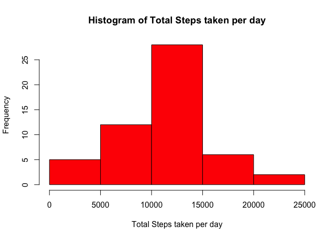
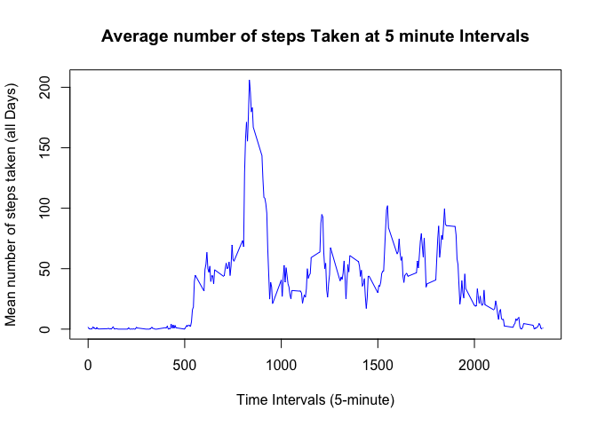
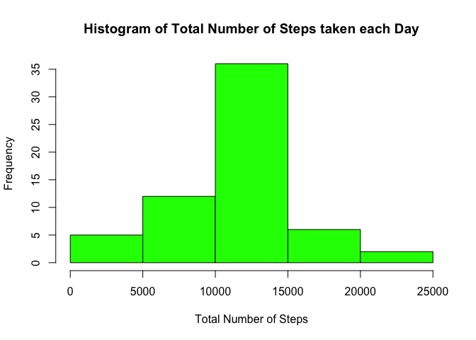
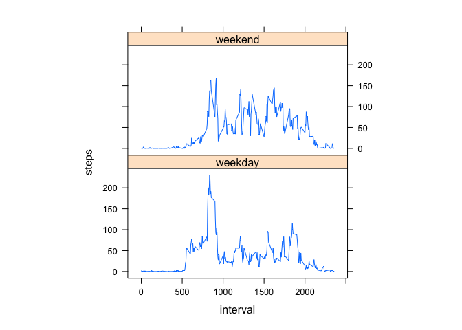

## Code for reading in the dataset and/or processing the data

```r
download.file("https://d396qusza40orc.cloudfront.net/repdata%2Fdata%2Factivity.zip",destfile = "activity1.zip")
unzip("activity1.zip")
activity <- read.table("activity.csv",sep = "," , header = TRUE)
```

Preprocessing the data : Calculating the totalSteps data frame with steps & date

```r
totalSteps <- aggregate(steps ~ date, data = activity, sum, na.rm = TRUE)
nrow(totalSteps)
```

```
## [1] 53
```

## Histogram of the total number of steps taken each day

```r
hist(totalSteps$steps,col="red",main="Histogram of Total Steps taken per day",xlab="Total Steps taken per day",cex.axis=1,cex.lab = 1)
```

<!-- -->

## Mean and median number of steps taken each day

```r
mean_steps <- mean(totalSteps$steps)
print(paste("Mean number of steps taken each day ", mean_steps , sep = "="))
```

```
## [1] "Mean number of steps taken each day =10766.1886792453"
```

```r
median_steps <- median(totalSteps$steps)
print(paste("Median number of steps taken each day ", median_steps , sep = "="))
```

```
## [1] "Median number of steps taken each day =10765"
```


## Time series plot of the average number of steps taken

```r
steps_interval <- aggregate(steps ~ interval, data = activity, mean, na.rm = TRUE)
plot(steps ~ interval, data = steps_interval, type = "l", xlab = "Time Intervals (5-minute)", ylab = "Mean number of steps taken (all Days)", main = "Average number of steps Taken at 5 minute Intervals",  col = "blue")
```

<!-- -->

## The 5-minute interval that, on average, contains the maximum number of steps

```r
maxStepInterval <- steps_interval[which.max(steps_interval$steps),"interval"]
print(paste("Maximum number of steps in the 5 min interval ", maxStepInterval , sep = "="))
```

```
## [1] "Maximum number of steps in the 5 min interval =835"
```

## Code to describe and show a strategy for imputing missing data

```r
missing_rows <- sum(!complete.cases(activity))
print(paste("Total number of missing rows ", missing_rows , sep = "="))
```

```
## [1] "Total number of missing rows =2304"
```

```r
getMeanStepsPerInterval <- function(interval){
    steps_interval[steps_interval$interval==interval,"steps"]
}

complete.activity <- activity

## Filling the missing values with the mean for that 5-minute interval
flag = 0
for (i in 1:nrow(complete.activity)) {
    if (is.na(complete.activity[i,"steps"])) {
        complete.activity[i,"steps"] <- getMeanStepsPerInterval(complete.activity[i,"interval"])
        flag = flag + 1
        }
}

print(paste("Total number of missing values filled  ", flag , sep = "="))
```

```
## [1] "Total number of missing values filled  =2304"
```

## Histogram of the total number of steps taken each day after missing values are imputed

```r
total.steps.per.days <- aggregate(steps ~ date, data = complete.activity, sum)
hist(total.steps.per.days$steps, col = "green", xlab = "Total Number of Steps", 
     ylab = "Frequency", main = "Histogram of Total Number of Steps taken each Day")
```

<!-- -->

## Panel plot comparing the average number of steps taken per 5-minute interval across weekdays and weekends

```r
complete.activity$day <- ifelse(as.POSIXlt(as.Date(complete.activity$date))$wday%%6 == 
                                    0, "weekend", "weekday")
complete.activity$day <- factor(complete.activity$day, levels = c("weekday", "weekend"))

steps.interval= aggregate(steps ~ interval + day, complete.activity, mean)
library(lattice)
xyplot(steps ~ interval | factor(day), data = steps.interval, aspect = 1/2, 
       type = "l")
```

<!-- -->

